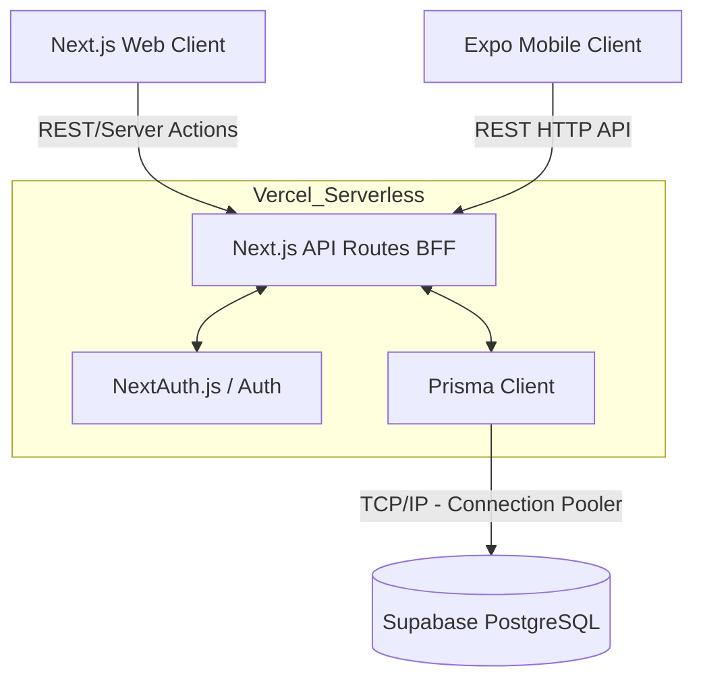

# CPMS Technical Documentation – Part 1: Overview, Structure & Architecture

## Executive Summary
**CPMS (Construction Procurement & Management System)** is a comprehensive Enterprise Resource Planning (ERP) platform explicitly designed for the construction industry. It enables construction companies to manage vendors, procurement (Indents -> Purchase Orders -> Goods Receipt Notes), site inventory, and labor tracking. 

This project is structured as a **monorepo** utilizing Turborepo, which encapsulates both a **Next.js Web Application** and an **Expo React Native Mobile Application**. The shared resources include UI components and utilities to maintain consistency across the web and mobile ecosystems.

---

## STEP 1 — PROJECT STRUCTURE

The repository is organized as a monorepo utilizing **pnpm workspaces** and **Turborepo** for optimized build processes. 

### Root Directory Overview

- **`/apps`**: Contains the main consumer-facing applications.
  - **`/apps/web`**: The Next.js web application for managers, admins, and procurement officers.
  - **`/apps/mobile`**: The Expo (React Native) mobile application, typically for site engineers, employees, and on-site staff.
- **`/packages`**: Contains shared code utilized by the applications in `/apps`.
  - **`/packages/ui`**: Shared UI components and configurations (e.g., Tailwind configuration) for consistent design across web and mobile.
  - **`/packages/utils`**: Shared utility functions and formatting logic.
- **`/prisma`**: Contains the unified database schema, migration configurations, and seed scripts.
- **`/scripts`**: Automation scripts for development, such as generating CSS from Figma tokens.
- **`/docs`**: Contains documentation, UI guidelines, etc.
- **`package.json`**: The root package.json defining the workspace and monorepo scripts.
- **`pnpm-workspace.yaml`**: Configures pnpm to recognize `/apps` and `/packages` as workspace members.
- **`turbo.json`**: Configuration for Turborepo, optimizing build, lint, and development tasks caching.

### Detailed Folder Analysis

#### `/apps/web` (Next.js Application)
This is the core dashboard and administration panel.
- **`/src/app`**: Uses Next.js App Router.
  - **`/(app)`**: Protected routes requiring authentication (e.g., dashboard, procurement, projects, vendors). The use of parentheses `(app)` allows route grouping without affecting the URL path.
  - **`/(auth)`**: Public routes for authentication (login, signup).
  - **`/api`**: Backend API routes (Next.js serverless functions) for CRUD operations and authentication callbacks.
  - **`layout.tsx` & `page.tsx`**: The root layouts and entry points.
- **`/src/components`**: Reusable React components specific to the web app.
  - **`/layout`**: Layout components like `Sidebar.tsx`, `TopBar.tsx`.
  - **`/ui`**: Base UI elements.
- **`/src/lib`**: Core libraries and configurations.
  - **`auth.ts`**: Configuration for NextAuth.js.
  - **`prisma.ts`**: Singleton Prisma client initialization.
- **`/src/generated`**: Autogenerated Prisma client files for Edge compatibility.
- **`/src/styles`**: Global CSS and design tokens.
- **`next.config.ts`**: Configuration for the Next.js compiler and bundler.

#### `/apps/mobile` (Expo Mobile Application)
The application used by on-field construction workers and site managers.
- **`/src/app`**: Uses Expo Router (file-based routing for React Native).
  - **`/(app)`**: Protected routes representing the main application tabs.
    - **`/(tabs)`**: The bottom tab navigation structure containing screens like `attendance`, `indents`, `projects`, etc.
  - **`login.tsx` & `login.web.tsx`**: Authentication screens.
- **`/src/components`**: React Native components.
  - **`/dashboard`**: Role-specific dashboard views (e.g., Employee, Manager).
  - **`/ui`**: Reusable UI components.
- **`/src/core`**: Core logic and state management.
  - **`api.ts`**: Axios/Fetch wrappers for API communication.
  - **`authStore.ts`**: Zustand store for managing authentication state.
- **`/assets`**: Static assets like images, icons, and splash screens.
- **`app.json` / `eas.json`**: Expo and EAS build configurations.
- **`tailwind.config.js` / `babel.config.js`**: Configurations for styling via NativeWind.

#### `/prisma`
The single source of truth for the database.
- **`schema.prisma`**: Defines the data models, relationships, enums, and database connection.
- **`seed.ts`**: Script to populate the database with initial/dummy data.

---

## STEP 2 — TECHNOLOGY STACK

### Core Frameworks & Libraries

1. **Next.js (v16.2.6)**
   - **What it is:** A React framework for production.
   - **Why it was chosen:** It provides Server-Side Rendering (SSR), Static Site Generation (SSG), and API routes out of the box. 
   - **Role:** Powers the web dashboard, routing, and backend API logic.
   - **Advantages:** Excellent SEO, file-system based routing (App Router), seamless full-stack capabilities.

2. **React (v19.2) & React Native (v0.86)**
   - **What it is:** UI libraries for building interfaces.
   - **Why it was chosen:** Allows code sharing between web and mobile platforms.
   - **Role:** Foundation for all frontend code in both web and mobile apps.

3. **Expo (v57)**
   - **What it is:** A framework and platform for universal React applications.
   - **Why it was chosen:** Simplifies React Native development, builds, and deployments (EAS).
   - **Role:** Powers the mobile app development lifecycle and routing via Expo Router.

4. **TypeScript (v5/v6)**
   - **What it is:** A typed superset of JavaScript.
   - **Why it was chosen:** Catches errors at compile-time and provides exceptional autocompletion.
   - **Role:** Used universally across the entire monorepo.

### Database & ORM

5. **PostgreSQL (Hosted on Supabase)**
   - **What it is:** A powerful, open-source object-relational database.
   - **Why it was chosen:** Reliable, supports complex relational queries needed for an ERP (Vendors, Projects, Orders).
   - **Role:** The primary database for all CPMS data.

6. **Prisma (v7.8.0)**
   - **What it is:** A next-generation Node.js and TypeScript ORM.
   - **Why it was chosen:** Type-safe database access, automated migrations, and easy-to-read schema definition.
   - **Role:** Connects the Next.js API routes to the PostgreSQL database.

7. **Supabase (pgbouncer)**
   - **What it is:** An open-source Firebase alternative providing PostgreSQL.
   - **Why it was chosen:** Easy hosting, built-in connection pooling (`pgbouncer`), which is critical for serverless environments like Vercel.

### Styling & UI

8. **Tailwind CSS (v4 on Web, v3 on Mobile)**
   - **What it is:** A utility-first CSS framework.
   - **Why it was chosen:** Speeds up UI development without writing custom CSS classes.
   - **Role:** Primary styling tool for both Web (PostCSS) and Mobile (via NativeWind).

9. **NativeWind (v4.2.6)**
   - **What it is:** Tailwind CSS for React Native.
   - **Why it was chosen:** Allows sharing of Tailwind classes and design tokens between Next.js and Expo.

10. **Lucide Icons**
    - **What it is:** A beautiful and consistent icon toolkit.
    - **Role:** Provides icons for buttons, sidebars, and UI elements.

### Authentication & State Management

11. **NextAuth.js (v5 Beta)**
    - **What it is:** A complete open-source authentication solution for Next.js.
    - **Why it was chosen:** Handles session management, JWTs, and secure cookie creation seamlessly.
    - **Role:** Secures the web dashboard via Credentials Provider and JWT strategies.

12. **Zustand (v5.0.3)**
    - **What it is:** A small, fast, and scalable bearbones state-management solution.
    - **Why it was chosen:** Simpler and less boilerplate than Redux.
    - **Role:** Manages global state (like user sessions) in the Expo Mobile application (`authStore.ts`).

13. **Bcrypt.js**
    - **What it is:** Password hashing library.
    - **Role:** Hashes and compares user passwords securely in the NextAuth configuration.

### Tooling & Monorepo

14. **Turborepo**
    - **What it is:** A high-performance build system for JavaScript/TypeScript codebases.
    - **Why it was chosen:** Drastically reduces build times by caching unchanged packages in the monorepo.
    - **Role:** Orchestrates `dev`, `build`, and `lint` commands across the workspace.

15. **pnpm**
    - **What it is:** Fast, disk space efficient package manager.
    - **Role:** Manages dependencies via workspaces (`pnpm-workspace.yaml`).

---

## STEP 3 — APPLICATION ARCHITECTURE

The architecture of CPMS follows a tightly integrated **Serverless Monolith Architecture** utilizing a **BFF (Backend-for-Frontend)** pattern.

### High-Level Architecture Diagram

### Core Architecture Components

1. **The Shared Backend (BFF):**
   Unlike traditional systems where the backend is a separate Express or SpringBoot server, CPMS uses the Next.js `/api` directory as its backend. This acts as a BFF. Both the Web App (via fetch or server components) and the Mobile App (via Axios/Fetch) communicate with these API routes.

2. **Data Layer (Prisma & PostgreSQL):**
   The Prisma Client acts as the Data Access Layer (DAL). Due to the serverless nature of Next.js API routes (where each request might spin up a new instance), connections to the database can quickly exhaust the limit. To solve this, the architecture uses `pgbouncer=true` in the `DATABASE_URL` to route through Supabase's built-in connection pooler.

3. **Authentication Flow:**
   - **Web:** Utilizes NextAuth.js. When a user logs in, NextAuth verifies credentials via Prisma, creates a JWT, and sets an encrypted `HttpOnly` cookie in the browser. Subsequent requests attach this cookie automatically.
   - **Mobile:** The mobile app likely authenticates against an endpoint (e.g., `/api/auth/login` or via the web NextAuth setup), receives a JWT or session identifier, and stores it in `expo-secure-store` using the Zustand `authStore.ts`.

4. **Shared UI & Utils Workspace:**
   To ensure the brand identity is unified, the `packages/ui` and `packages/utils` allow the web and mobile apps to import identical types, validation schemas, or UI components. This prevents duplicated code.

5. **Serverless Deployment:**
   The Web app and the API are designed to be deployed on **Vercel**. Vercel splits the Next.js API routes into distinct AWS Lambda functions (Serverless Functions) and serves the static assets via its Edge Network.

---
*End of Part 1. The documentation will continue in the next parts.*
